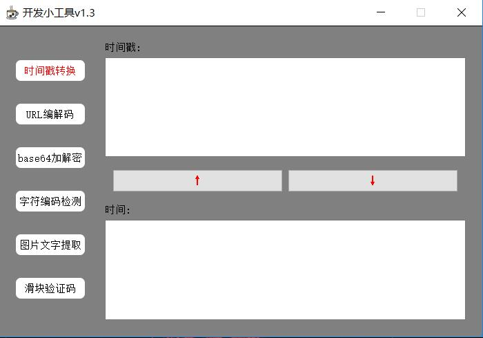
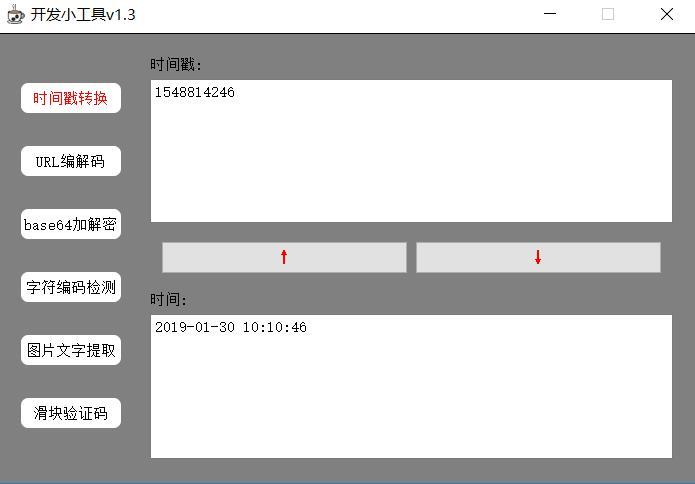
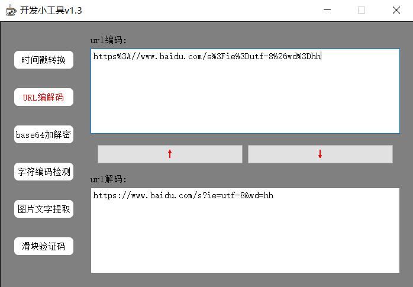
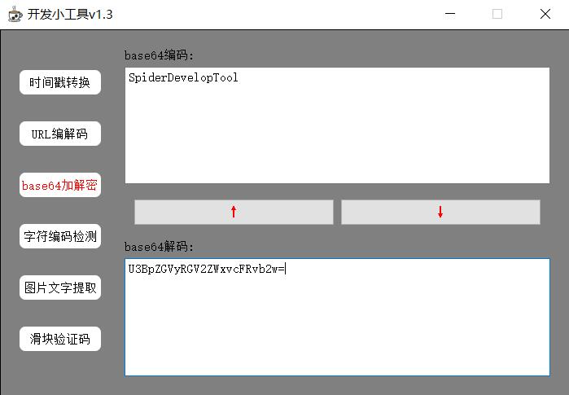
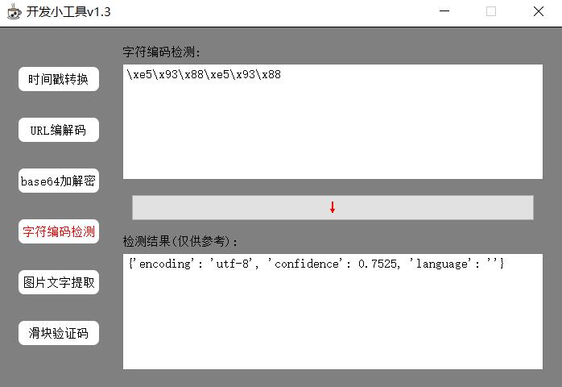
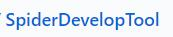
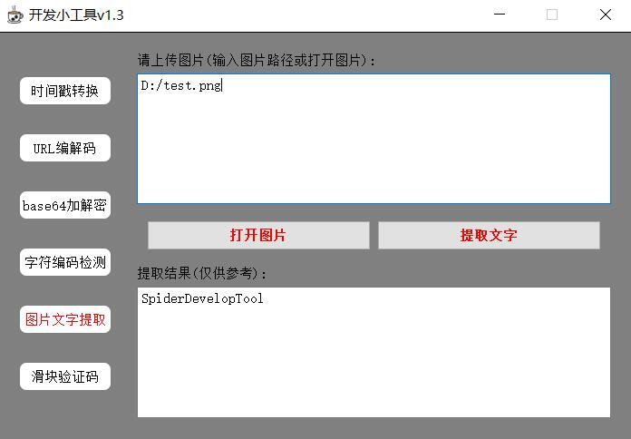
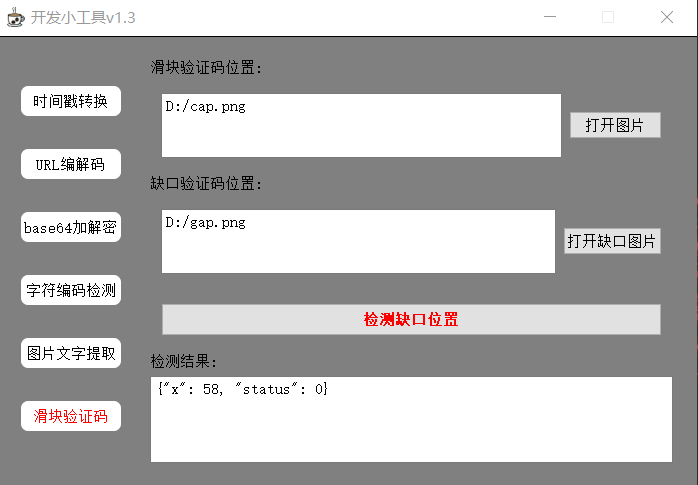

# SpiderDevelopTool
爬虫开发小工具(时间戳转换，base64加解密，URL编解码,字符编码检测, 图中文字提取,滑块验证码破解)  
**优点: 无须连接互联网,纯python代码实现**  
### 注意: 杀毒软件可能会误报毒,信任即可.

###  软件截图

主要是写pyqt练手,另外写爬虫的时候会用到这些工具,不用每次都百度，打开就能使，方便自己！

#### 功能一

#### 功能二

#### 功能三

#### 功能四
字符编码检测采用的是chardet模块

 
#### 功能五
文字提取用的是pytesseract模块，注意，此模块的使用必须提前下载好tesseract-ocr并添加到环境变量  

待检测图  
  
结果图  

#### 功能六
此功能需要联网，请按需使用。输入滑块图片和缺口图片存储位置，会返回缺口的x坐标

##### 滑块验证码样例
滑块验证码(cap)  
  

缺口验证码(gap)  
  

检测结果:  

