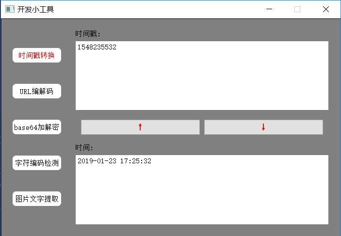
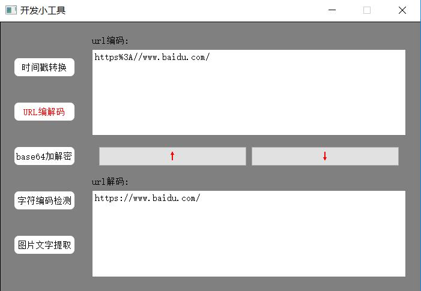
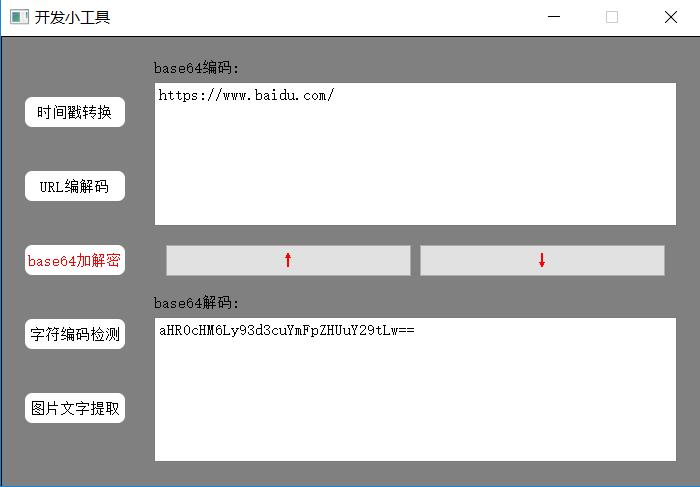
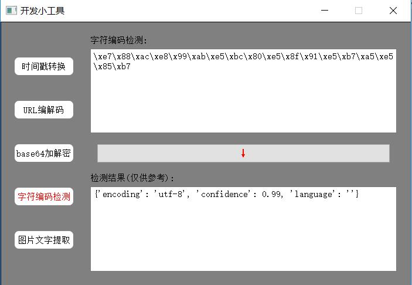
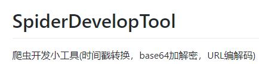
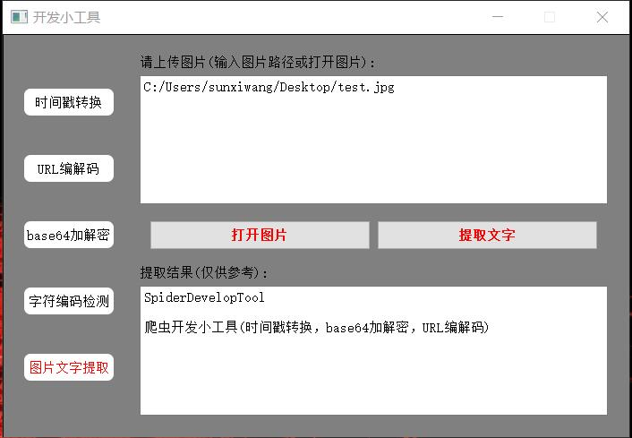

# SpiderDevelopTool
爬虫开发小工具(时间戳转换，base64加解密，URL编解码)
###  软件截图

主要是写pyqt练手,另外写爬虫的时候会用到这些工具,不用每次都百度，打开就能使，方便自己！

#### 功能一

#### 功能二

#### 功能三

#### 功能四
字符编码检测采用的是chardet模块

#### 功能五
文字提取用的是pytesseract模块，注意，此模块的使用必须提前下载好tesseract-ocr并添加到环境变量，否则，此功能无法正常使用
待检测图

结果图
